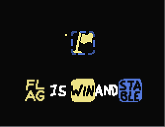

# Modpack settings
Introducing the all-new ~~totally not inspired by EvanEMV's metatext mod~~ settings menu for my modpack!

These are levelpack-specific settings that affects certain features of my modpack. You can set these settings, share your levelpack, and the settings will (ideally) be carried over when people play your levelpack!

You can access the settings menu directly from the game itself! Just click this button on the levelpack menu:

---

## Current settings

---
### **Disable Net Shifting**
This disables a change in shift logic to make directional shift work. 

In vanilla, if you have multiple `X is shift`'s, the game will process each shift statement one at a time, leading to an odd priority system if each `shift` action is in different directions.

This modpack discards the vanilla method to implement "Net Shifting". When there are multiple `shift`'s in different directions, the mod calculates an overall shift effect from summing up all the `shift` actions. *Then* it applies it to the shifted object.

Disabling net shifting will revert to the old vanilla method. But note that **it also disables directional shift.** If you make `belt is shiftup`, the game will treat it as a normal `belt is shift`.

| Vanilla | With Net Shifting |
| ------- | ----------------- |
|  | |

---
### **Disable Stable Text Display**
This disables the hover text shown when displaying the rules formed by STABLE.

| Enabled | Disabled |
| ------- | ----------------- |
|  | |

---
### **Disable Guard Chaining**
"Guard Chaining" is my term for recursive guarding. If `keke guard baba` and `bat guard keke` and baba steps onto a sink object, guard chaining would cause bat to die instead of keke. Keke steps in to guard baba *first*, then bat steps in to guard keke, meaning that bat will take the final blow.

This seems intuitive at first. However it can get pretty complex with multiple guard statements all over the place. If the complexity is too much, you can use this option to disable guard chaining for your levelpack. Disabling guard chaining will make GUARD actions happen "on one layer", similar to how if `X mimic Y` and `Y mimic Z`, X doesn't mimic the properties of Z.

| With Guard Chaining | Without Guard Chaining |
| ------- | ----------------- |
|  | |