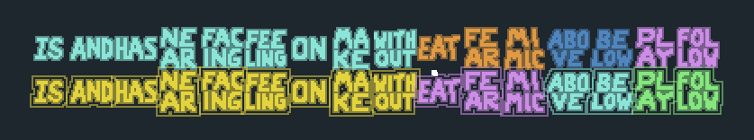

# Baba is You Mod - Omni Connectors

## **A few disclaimers/notes**
- This is more of a "What if" mod than something intended to add good content to the game. If it feels weird and complicated, I wouldn't be surprised.
- This mod heavily deals with the rule parsing logic, which has many layers of complexity (Also flawed in some areas). If there's a bug with this mod somewhere, feel free to report it, but theres a chance that it won't be addressed due to said complexity. 

Adds two variants of connector texts (is, has, near, facing, make, etc) that can change how a rule gets parsed, creating...interesting sentence layouts.

Here's a demo of both variants in action:\

---
## Pivot Text
Switches the direction of rule parsing depending on the original direction of parsing. If a rule starts horizontal, it continues vertically after the pivot text. And vice versa.

## Omni Text
Splits rule parsing both horizontally and vertically after the omni text, regardless of the original parsing direction. An easy way to create a lot of rules with little text.

