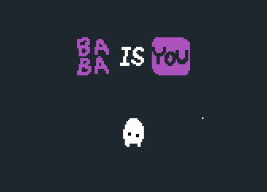

# Baba is You Mod - Omni Connectors

## **A few disclaimers/notes**
- This is more of a "What if" mod than something intended to add good content to the game. If it feels weird and complicated, I wouldn't be surprised.
- This mod heavily deals with the rule parsing logic, which has many layers of complexity (Also flawed in some areas). If there's a bug with this mod somewhere, feel free to report it, but theres a chance that it won't be addressed due to said complexity. 

Adds variants of all connector texts (is, has, near, facing, make, etc) where sentence parsing can split in both directions, creating...interesting sentence layouts.

So stuff like this ~~abomination~~ is possible:

Or this fun layout:

