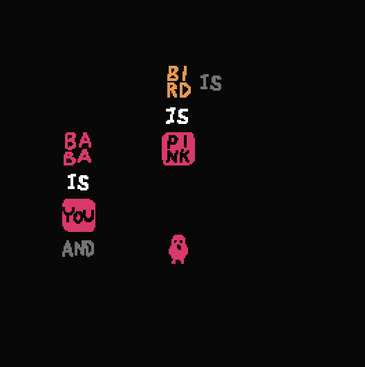

# Baba is You Mod - STABLE

Special thanks to @Digin#1490 in the Unofficial Baba Discord for providing the original idea and various others in #asset-is-make who helped refined the idea!

One of the more abstract mods I made, STABLE is a property that preserves all properties applied to an object the moment that object becomes STABLE. While an object has this property, the object cannot gain or lose any properties from making or breaking sentences. Only when the object stops becoming STABLE does it lose the set of properties applied from STABLE.

This is definitely a more complex mod that's harder to explain in words. So I also added the ability to reveal what rules are applied to a STABLE object, *using your mouse cursor!*  

Here's a gif of it in action:

