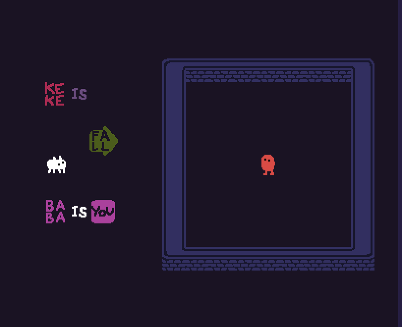
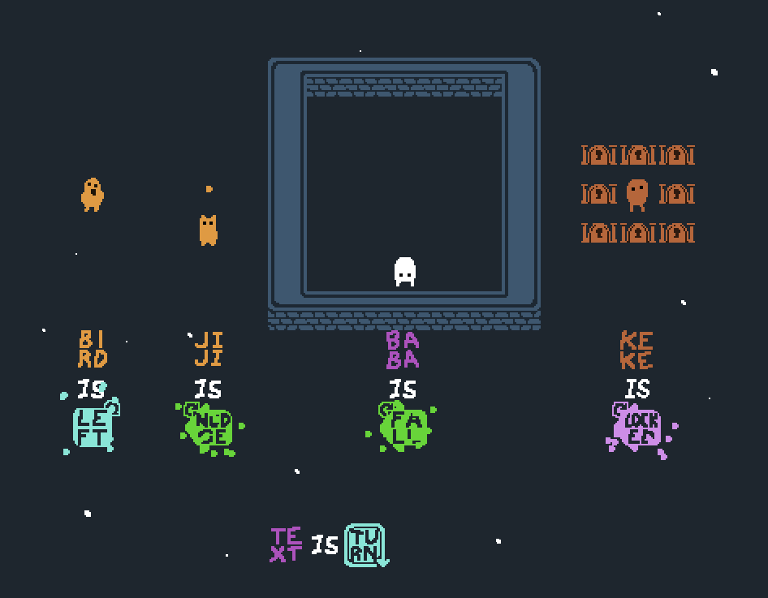
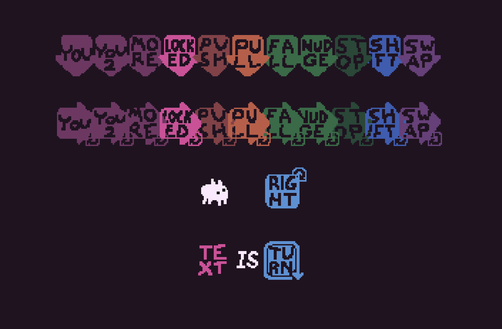
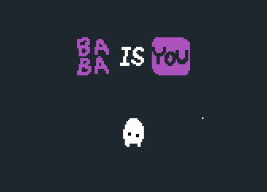
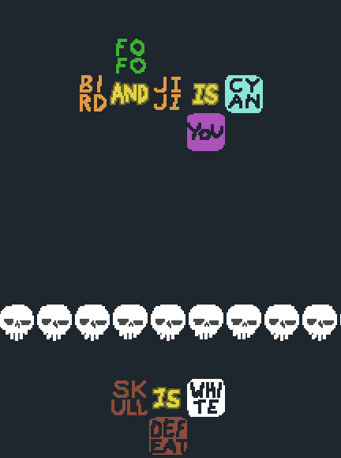
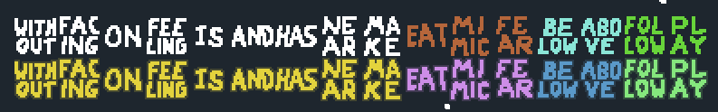
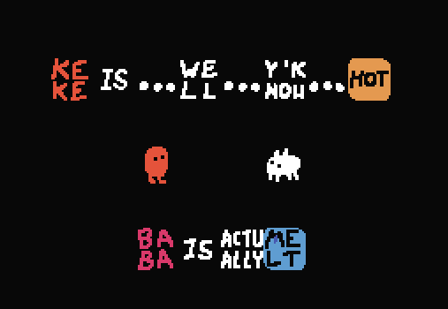

# Plasma's mods - Baba Is You

**Current compatable Baba Is You version: Beta 400b on PC**

This is a merged collection of all of my Baba mods I made so far. Download this if you want to use all of my mods at once rather than individually.

**Note:** in the future I'll add more mods directly to this modpack rather than making a github page for each of them. But since the below mods are pretty big I'll keep the old github pages open in case anyone wants to download them seperately.

Mods with seperate repositories
- [Arrow Properties Plus/Turning Text](https://github.com/PlasmaFlare/Baba-Is-You-Arrow-Properties-Plus)
- [Omni Connectors](https://github.com/PlasmaFlare/Baba-Is-You-Mod-Omni-Connectors)

# Installation
### A few notes before installing
- **This modpack is not guaranteed to be compatable with mods created by other people.**
- If you are switching from using one of my mods to this modpack, you'll have to uninstall the single mod first. **Backup your worlds if you do this.** Normally, deleting all lua files from my mod will achieve this. 

To install, copy both Lua and Sprites folder into the levelpack you want to include the mod. Make sure the world_data.txt in the levelpack folder has `mods=1` set underneath the `[General]` section.

# Changelog
- **1.0.0** (4/2/21)
  - Initial Release

# List of mods
**And now, a giant collection of gifs designed purely to advertise my modpack**

## Arrow Properties Plus (Turning Text)
Adds variants of existing properties as directional arrows! Also adds arrow properties where their meaning changes based on their facing direction.

---------------------
## Omni Connectors
Adds variants of all connector texts (is, has, near, facing, make, etc) where sentence parsing can split in both directions, creating...interesting sentence layouts.

---------------------
## Filler Text
Uhhhhhhh......well so uhhh yea. This is... hmmm.. a mod that adds... y'know... 14 texts with no meaning whatsoever. Acts as "filler", extending any rules you make with **vacuous meaning!**

(Done for April Fools lol)

